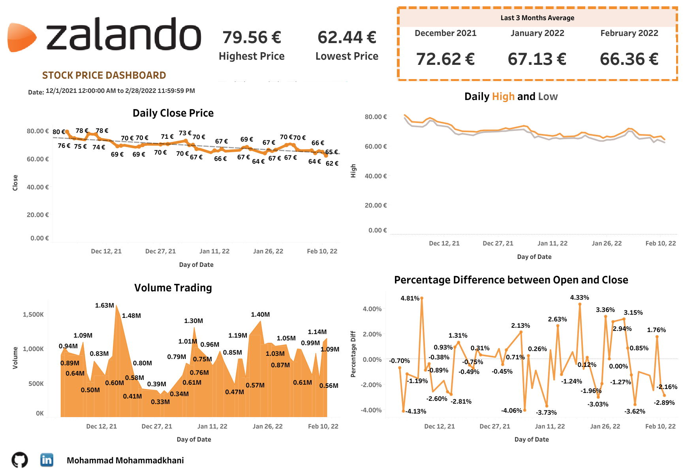

# Free to be

Zalando SE is a German multi-national E-commerce company based in Berlin, Germany. The company follows a platform approach, offering fashion and lifestyle products to customers in 23 European markets. 
One of the shareholders is tired of receiving monthly updates of the stock price. He would like to see any trends of stock price specifically for the last three months. He also wants this data to be updated daily. He also expects to know the average monthly stock price, daily closing figures, and volume of traded stock.

* Generated and Connected an automated Google Sheets data source that updates Zalando stock price on a daily basis.
* Created a Zalando stock price report in Tableau giving detailed insights about the closing price, volume of traded stock, and percentage change per day.
* Improved user experience by date range filters and visual interactions.

Dashboard is available on [Tableau Public](https://public.tableau.com/app/profile/mo.with.data/viz/ZalandoStockPriceDashboard/Dashboard)

